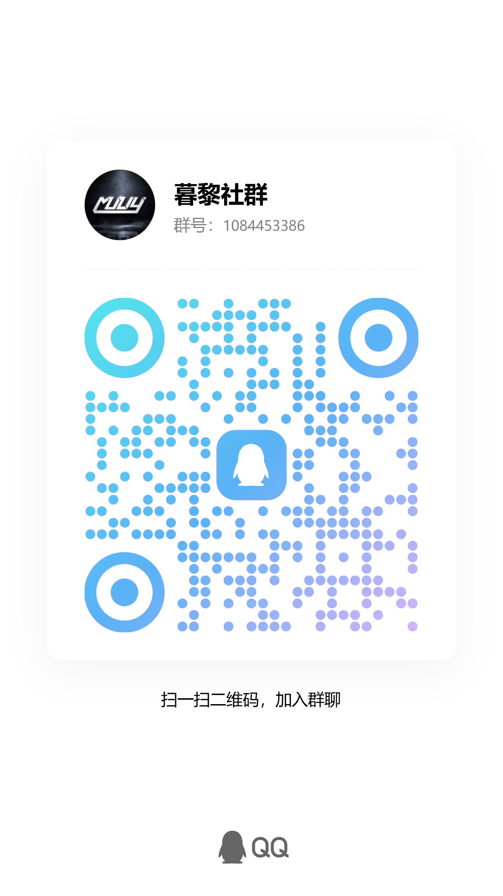

<p align="center">
  
</p>

<h1 align="center">暮黎资源聚合</h1>

<p align="center"><strong>AstrBot 全能资源搜索插件</strong> — 小说 / 影视 / 游戏 / 软件搜索 · 日报 · 网易云语音名片 · VIP 解析 · 摸头/踢/按摩表情包</p>

<p align="center">
  
  
  
</p>

---

> ⚠️ **免责声明**
>
> 本插件由各路 AI 制作，仅用于内部测试和学习交流，**切勿用于商业用途**。禁止盗卖、转载，侵权必删。
> 交流群：**1084453386**，可体验完整功能。

---

## 功能一览

| 模块 | 功能 | 说明 |
|------|------|------|
| 🎬 | **影视搜索（双源）** | a123tv 旧站（免登录）与教父.com 新站（需登录态 Cookie，含在线播放 + 网盘双模式）按 Cookie 自动切换；剧集自动选集数、电影直接选播放线路 |
| 🌐 | **教父.com 新站影视源** | 配置 `muliy_cookie`（浏览器登录态 Cookie）即启用；自动探测最低延迟节点（跳过 PoW + 验证码），含网盘资源多网盘下载；未配置则回退 a123tv 旧站 |
| 🎮 | **游戏搜索** | 在 xdgame.com 搜索游戏，支持多网盘下载链接 |
| 💿 | **软件搜索** | 在 x6d.com 搜索软件 / 应用 / 工具资源 |
| 📖 | **小说搜索与下载** | 基于开源 [so-novel](https://github.com/freeok/so-novel) 的多源聚合小说搜索与下载：搜书名/作者 → 分页选源 → 选格式（txt/epub/html/pdf）→ 以文件形式发送整本小说 |
| 🔍 | **统一搜索** | LLM 自动判断资源类型，跨库一次搜完 |
| 🛡️ | **搜索关键词审核** | 所有资源搜索（统搜/游戏/软件/影视）在发起抓取前，先调用大模型审核关键词是否涉黄/违禁，命中即拦截；同时判断用户搜索意图 |
| 📰 | **软件日报** | 每日定时推送最新软件到群聊（**以文件形式发送**日报图，绕开 onebot 发图体积上限，不再发送 ZIP 文件） |
| 🎮 | **游戏日报** | 每日定时抓取当前游戏源（XDGAME / switch618）当日更新的游戏，取标题/简介/截图，排版成卡通风格 HTML 后渲染为图片、**以文件形式推送到群聊** |
| 🎬 | **影视日报** | 每日定时抓取影视站主页「最近更新」的电影/剧集/动漫，取名称/封面/状态/简介，排版成毛玻璃简约风格 HTML 后渲染为图片、**以文件形式推送到群聊**；配置了 `muliy_cookie` 走教父.com 新站，未配置自动回退 a123tv 旧站（免登录也能出日报） |
| 🔐 | **Cookie 刷新** | 纯 HTTP 自动登录 xdgame，零浏览器依赖 |
| 🎵 | **网易云语音名片** | 发送网易云链接 / 小程序分享，自动解析为 mp3 并以 QQ 语音发送（时长 = min(歌曲时长, 最大发送歌曲时长)，不满上限则整曲） |
| 🎵 | **网易云扫码登录** | 管理员发送 `/wyy_login` 获取登录二维码，网易云 App 扫码确认后自动提取会员 Cookie 写入 `wyy_cookie`（需 `wyy_custom_url` 后端在线） |
| 🎞️ | **VIP 视频解析（交互式选接口）** | 仅支持爱奇艺/腾讯视频/优酷/芒果TV 四大平台 VIP 视频链接解析（其余平台链接不再识别） |
| 🤚 | **娱乐功能** | 发送 `摸摸 @某人`，自动生成并发送摸头 GIF 动图（圆形头像） <br> 发送 `给你一脚 @某人`，生成「马踢舔狗」GIF，被@成员为舔狗、发送者为踢人者（头像优先） <br> 发送 `给我按摩 @某人`，生成柴犬按摩 GIF，被@成员为被按摩者、发送者为按摩者（头像优先） |

---

## 快速开始

### 方式一：AstrBot 插件市场（推荐）

1. 打开 AstrBot WebUI → **插件管理**
2. 搜索「暮黎资源聚合」→ 点击安装
3. 在插件配置中填写 `xdgame_username` / `xdgame_password`（用于自动刷新游戏 Cookie；影视搜索无需配置）
4. **小说搜索**：需另起一个 [so-novel](https://github.com/freeok/so-novel) 实例并以 Web 模式（`-Dmode=web`，默认端口 7765）运行，并在 `novel` 分组填写 `sonovel_base_url`（同机 `http://127.0.0.1:7765`；so-novel 跑在 Docker 且与 AstrBot 同宿主机时用 `http://172.17.0.1:7765`）

### 方式二：手动安装

```bash
# 克隆到 AstrBot 插件目录
cd <astrbot>/data/plugins/
git clone https://github.com/muliystudio/astrbot_plugin_muliyresources.git

# 重启 AstrBot
```

---

## 配置说明

在 AstrBot WebUI 插件设置中填写：

| 配置项 | 类型 | 默认值 | 说明 |
|--------|------|--------|------|
| `cookie` | string | `""` | xdgame.com Cookie（可用命令自动刷新） |
| `xdgame_username` | string | `""` | xdgame 账号（用于 game_cookie_refresh） |
| `xdgame_password` | string | `""` | xdgame 密码 |
| `max_search_results` | int | `32` | 最大搜索结果数（1–48） |
| `schedule_hour` | int | `10` | **软件日报**推送时间（时，UTC+8），与游戏日报独立 |
| `schedule_minute` | int | `0` | **软件日报**推送时间（分），与游戏日报独立 |
| `group_ids` | string | `""` | **软件日报**推送群号，逗号分隔，留空则不推送（与游戏日报独立） |
| `game_report_enabled` | bool | `true` | 游戏日报总开关 |
| `game_schedule_hour` | int | `18` | **游戏日报**推送时间（时，UTC+8），与软件日报独立 |
| `game_schedule_minute` | int | `0` | **游戏日报**推送时间（分），与软件日报独立 |
| `game_group_ids` | string | `""` | **游戏日报**推送群号，逗号分隔，留空则不推送（与软件日报独立） |
| `game_report_max` | int | `24` | 游戏日报每期最多游戏数（1–50，过多会导致图片过长）；**xdgame 与 switch618 两种源均生效**（不再抓全） |
| `movie_report_enabled` | bool | `true` | 影视日报总开关（抓取影视站主页「最近更新」；配 `muliy_cookie` 走教父.com 新站，未配置自动回退 a123tv 旧站） |
| `movie_schedule_hour` | int | `20` | **影视日报**推送时间（时，UTC+8），与软件/游戏日报独立 |
| `movie_schedule_minute` | int | `0` | **影视日报**推送时间（分），与软件/游戏日报独立 |
| `movie_group_ids` | string | `""` | **影视日报**推送群号，逗号分隔，留空则不推送（独立） |
| `movie_report_max` | int | `24` | 影视日报每个区块（电影/剧集/动漫）最多部数（1–50） |
| `movie_sections` | string | `mv,tv,ac` | 影视日报包含的区块：mv=电影, tv=剧集, ac=动漫，逗号分隔；例：只推剧集填 `tv` |
| `report_retention_days` | int | `5` | 本地缓存日报 ZIP 保留天数（仅面板回看用；日报本身以「群文件」形式发送，不再上传 ZIP） |
| `wyy_auto_parse` | bool | `true` | 网易云语音名片：自动识别消息中的网易云链接 / 小程序卡片并解析 |
| `wyy_music_type` | string | `standard` | 解析音质（传递给自建 NeteaseCloudMusicApi 的 `/song/url?level=`）：`standard` / `exhigh` / `lossless` / `hires` / `jyeffect` / `sky` / `jymaster` |
| `wyy_custom_url` | string | `""` | **网易云解析后端地址（自建 NeteaseCloudMusicApi 实例地址，唯一后端）**。推荐填基础地址如 `http://127.0.0.1:3000`（自动取歌名/歌手）；也可填 `{id}` 模板。留空则网易云语音名片功能不可用 |
| `wyy_cookie` | string | `""` | 黑胶会员 Cookie（用于解析 **VIP/付费歌曲**）。留空仅能解析免费歌；填黑胶会员账号 Cookie 整串（含 `MUSIC_U` 与 `__csrf`）即可解析 VIP 歌曲（`standard`/`exhigh`/`lossless` 需黑胶会员，`sky`/`jymaster` 需超级会员）。⚠️ 敏感凭证，建议用专用会员小号，勿外泄 |
| `wyy_clip_seconds` | int | `600` | 最大发送歌曲时长（秒，默认 600 = 10 分钟）。实际发送语音时长 = min(歌曲时长, 该值)：设 120 则最长发前 120 秒；设 600 则不满 10 分钟的歌整曲发送 |
| `wyy_clip_start_ratio` | float | `0.33` | **（已废弃，v1.9.4 起不再生效）** 原用于指定高潮片段起点，现固定从歌曲开头发送、时长不超过 `wyy_clip_seconds` 上限 |
| `wyy_audio_format` | string | `mp3` | 语音格式：`mp3`（QQ 兼容性好）或 `wav` |
| `video_vip_parse` | bool | `true` | VIP 视频解析：消息里出现**四大平台**（爱奇艺/腾讯视频/优酷/芒果TV，含爱奇艺分享卡片 `playShare.html?shareId=`）的 VIP 视频链接才会被自动识别，提取影视信息并展示解析接口菜单；乐视/搜狐/bilibili/PPTV 等其它站点链接不再识别解析 |
| `video_vip_timeout` | int | `25000` | 单个解析接口超时（毫秒，建议 8000–60000） |
| `muliy_cookie` | string | `""` | **教父.com 新站**登录态 Cookie（启用新站影视源）。填此值 → 影视搜索走新站（含网盘资源，跳过 PoW + 验证码）；留空则回退 a123tv 旧站。需含 `app_auth` / `browser_verifie` / `PHPSESSID` 等字段，用英文分号 `;` 隔开 |
| `muliy_cache_ttl` | int | `3600` | 新站 Cookie 登录态 / 域名探测结果缓存秒数（默认 1 小时） |
| `sonovel_base_url` | string | `http://127.0.0.1:7765` | **so-novel Web 服务地址**（Jetty，默认端口 7765）。同机直连 `http://127.0.0.1:7765`；so-novel 跑在 Docker 且与 AstrBot 同宿主机用 `http://172.17.0.1:7765`（切勿填公网 IP，回环 NAT 易不通）；跨机/跨容器用 `http://<内网IP>:7765`。⚠️ 默认镜像启动的是 TUI 菜单、7765 不监听，须加 `-e JAVA_TOOL_OPTIONS="-Dmode=web"` 真正以 Web 模式启动 |
| `sonovel_token` | string | `""` | 访问令牌（可选）。官方 so-novel servlet 不做鉴权，留空即可；若部署在带鉴权的封装层后，填其 Bearer Token |
| `sonovel_search_limit` | int | `20` | 每源搜索结果上限（1–50），默认 20 |
| `sonovel_format` | list | `["txt"]` | 默认下载格式（可多选）：`txt` / `epub` / `html` / `pdf`。下载时若临时选了格式按所选生成；直接「下载/确认」则用全部默认格式。推荐至少保留 `txt` |
| `sonovel_timeout` | int | `30` | 聚合搜索与书源检查的网络超时（秒，5–120），默认 30 |
| `sonovel_download_timeout` | int | `600` | 整本下载等待上限（秒，30–1800），默认 600。大书可能需数分钟，超时将提示换源/换格式 |

> **浏览器设置共用**：游戏日报与 VIP 视频解析的 Playwright 浏览器设置已合并为统一的「浏览器」分组（`browser_channel` / `browser_exe`），配置一次即可同时生效，无需分别填写。

---

## 命令列表

| 命令 | 权限 | 说明 |
|------|------|------|
| `/找游戏 <名称>` | 所有人 | 在 xdgame.com 搜索游戏（需要登陆） |
| `/找软件 <名称>` | 所有人 | 在 x6d.com 搜索软件 |
| `/找小说 <名称>` | 所有人 | 基于 so-novel 多源聚合搜索小说，分页选源、选格式（txt/epub/html/pdf）后整本以文件形式发送 |
| `/找影视 <名称>` | 所有人 | 在 a123tv.com 搜索影视（无需登录） |
| `/movie_status` | 所有人 | 检查 a123tv.com 站点可达性 |
| `/novel_status` | 所有人 | 检查 so-novel 服务是否可达 + 书源可用性（排错用） |
| `/game_cookie_refresh` | 仅持有者 | 纯 HTTP 自动登录 xdgame，刷新 Cookie |
| `/game_cookie` | 所有人 | 检测 Cookie 状态（有效 / 失效 / 次数用尽） |
| `/software_report` | 可配置 | 手动触发当日软件日报 |
| `/game_report` | 可配置 | 手动触发当日游戏日报（按当前游戏源抓取当日新游，卡通图片） |
| `/movie_report` | 可配置 | 手动触发当日影视日报（影视站主页最近更新的电影/剧集/动漫，毛玻璃图片；无 `muliy_cookie` 时自动用 a123tv 旧站） |
| `/wyy <链接或ID>` | 所有人 | 解析网易云歌曲为 QQ 语音名片（手动触发，支持短链自动展开） |
| `/wyy_login` | 管理员 | 获取网易云登录二维码，App 扫码确认后自动把会员 Cookie 写入 `wyy_cookie`（依赖 `wyy_custom_url` 后端在线） |

> 开启 LLM 后，以上功能均可通过自然语言触发（搜索由 LLM 工具接管，无需记忆命令）。
> 网易云语音名片在 `wyy_auto_parse=true` 时**无需命令**，直接发链接 / 小程序卡片即自动解析。
> **VIP 视频解析**同样无需命令：直接把**四大平台**（爱奇艺/腾讯视频/优酷/芒果TV）的 VIP 视频链接（或爱奇艺分享卡片）发到对话里，插件会自动提取影视信息、把分享卡片转为纯净播放页，并展示「解析接口」菜单让你回序号挑选；选中后返回「聊天记录格式」结果（标题+简介+截图+直链）。**注意**：仅这四大平台会被识别解析，乐视/搜狐/bilibili/PPTV 等其它站点的链接不再触发解析。

---

### 表情包触发（无需 @机器人，直接发消息即可）

| 表情 | 触发词 | 说明 |
|------|--------|------|
| 🤚 摸头杀 | `摸摸` / `摸头` / `摸摸头` / `pat` / `rua` + `@某人` | 摸 @到的人的头；无 @ 时摸自己；多 @ 逐个生成 |
| 🐴 舔狗（给你一脚） | `给你一脚` / `一脚` / `踹` / `踢` / `kick` + `@某人` | 生成「马踢舔狗」GIF；被 @ 为舔狗，发送者为踢人者 |
| 💆 按摩 | `给我按摩` / `给我揉揉` + `@某人` | 生成柴犬按摩 GIF；被 @ 为被按摩者，发送者为按摩者 |

> 三个表情均 **priority=2 事件监听**，无需唤醒机器人；头像优先用成员圆形头像（QQ 平台自动拉取，其它平台回退文字）；无 @ 时对自己使用，多 @ 只处理第一个。

---

## LLM 工具链

连接 LLM 后，插件自动注册以下工具：

| 工具名 | 触发场景 | 行为 |
|--------|----------|------|
| `search_resource` | 资源类型不确定时 | 同时搜索游戏库 + 软件库，返回合并列表 |
| `search_game` | 明确要游戏 | 仅搜索 xdgame.com |
| `search_software` | 明确要软件 | 仅搜索 x6d.com |
| `search_movie` | 明确要影视（关键词：影视/电影/剧/追剧） | 搜索 a123tv.com，自动判断剧/电影并引导选择 |
| `search_novel` | 明确要小说（关键词：找小说/小说名/作者名） | 基于 so-novel 多源聚合搜索小说，返回结果列表供选源/选格式下载 |
| `paginate_results` | 说「下一页」等 | 翻页（支持影视 / 小说列表） |
| `select_search_result` | 回复数字（1、2…） | 获取详情 + 下载链接 |

> **影视特殊说明**：a123tv.com 只有「在线播放」（切换采集源）一种资源类型，无网盘。
> 用户选影视 → 自动识别剧 → 剧先选集数再选线路，电影直接选线路。
> 严禁对影视调用 `select_download_link`（会被插件拒绝）。

> **关键词智能清洗**：工具会自动去掉「游戏」「软件」等统称后缀，只保留具体名称搜索。例如「赛车游戏」→「赛车」，「微信软件」→「微信」。
> **搜索关键词审核（内容安全）**：统搜/游戏/软件/影视四类搜索在清洗出关键词、发起抓取之前，都会先调用大模型审核该关键词是否涉黄/违禁（网络搜索是否涉黄），并判断用户搜索意图；命中违禁词（含本地硬屏蔽词快速过滤）即拦截搜索并返回提示，不执行抓取。大模型不可用（fail-open）时放行正常搜索，仅记日志。

---

## 交互示例

### 有 LLM

```
用户: @机器人 "帮我找赛车游戏"
  ↓ LLM 调用 search_resource("赛车")
  ↓ 返回游戏列表（含序号）
用户: "1"
  ↓ LLM 调用 select_search_result("1")
  ↓ 返回详情 + 多网盘下载选项
用户: "百度网盘"
  ↓ LLM 调用 select_download_link("百度网盘")
  ↓ 发送合并转发
完成
```

### 无 LLM（命令式）

```
用户: /找游戏 死亡搁浅
  ↓ 机器人返回搜索结果列表
用户: 1        → 显示详情 + 下载链接
用户: 下一页   → 翻页
用户: 0        → 取消
```

### 影视搜索示例

```
用户: /找影视 怪物
  ↓ 机器人返回影视列表（含 emoji 序号 1⃣2⃣3⃣…，超过 9 个回落 [n]）
用户: 5        → 机器人识别是剧 → 自动列集数「[1] 第1集 [2] 第2集 …」
用户: 3        → 列播放线路「[1] HD中字 · 720p [2] 更新 · 1080p …」
用户: 2        → 合并转发（🎬 怪物 第3集 + 📡 线路 + 📖 简介 + 🔗 链接 + 封面图）

注：电影自动跳过集数步骤，直接显示播放线路。
```

### 网易云语音名片示例

```
# 自动模式（wyy_auto_parse=true，默认开启）
用户: https://music.163.com/song?id=1861173563
  ↓ 机器人识别为网易云链接 → 解析 → 下载 → ffmpeg 截取中间片段
  ↓ 发送语音 + 名片文本
🎵 《XXX》
👤 歌手
💽 专辑
🎤 已发送语音（第 80–160 秒 · 中间片段）

# 小程序分享卡片（QQ 转发的网易云卡片）同样自动识别

# 命令模式
用户: /wyy https://music.163.com/song?id=1861173563
  ↓ 同上
```

---

## 教父.com 新站影视源（双源自动切换）

影视搜索支持**两个源**，由是否配置教父.com 登录态 Cookie 自动切换，**无需手动配置**：

- **已配置 `muliy_cookie`** → 走**教父.com 新站**：
  - 以浏览器登录态 Cookie 访问（跳过 PoW + 验证码），登录态缓存复用
  - 自动从挂了 `.com` 的候选域名中探测**最低延迟可用节点**
  - 资源含**在线播放（多节点）** 与 **网盘资源（多网盘）** 双模式：选影视 → 选资源类型 → 选节点 / 网盘 → 合并转发（标题 + 封面 + 简介 + 链接）
- **未配置 Cookie** → 自动回退 **a123tv 旧站**（无需登录，仅在线播放切换线路）

> 旧站（a123tv）只有在线播放一种资源类型、无网盘；新站额外提供网盘下载。想强制只用旧站可在配置里把 `movie_source` 显式填 `a123tv`。

---

## Cookie 刷新（纯 HTTP）

xdgame.com Cookie 有效期约 30 天，过期后执行 `/game_cookie_refresh` 自动刷新：

1. 机器人通过 HTTP 请求自动登录 xdgame（无需浏览器）
2. 若有验证码，机器人将验证码图片发到群里
3. 你在群里发送看到的字符，机器人自动提交
4. 登录成功后 Cookie 自动保存到配置

**技术实现**：

- `POST /user/index_do.php` — dede 标准表单登录，服务器返回纯文本（`success` 或错误信息）
- `GET /include/vdimgck.php` — 验证码图片（与登录表单共享 `server_session` 会话 Cookie）
- 全程零浏览器，httpx / aiohttp 异步 HTTP，无 Playwright 依赖

---

## 游戏日报（XDGAME / switch618 双源）

每天（按独立的 `game_schedule_hour`/`game_schedule_minute` 与 `game_group_ids`，与软件日报分开）自动抓取**当前游戏源**列表页，筛选出**当天更新**的游戏并推送到群聊。当前游戏源由 `game_source`（auto / xdgame / switch618）决定，与游戏搜索共用同一套源路由——配置了 xdgame 账密走 XDGAME，否则走 switch618.com。

**XDGAME 源**（[列表页](https://www.xdgame.com/list/1/)）：

- **筛选逻辑**：读取每个游戏 `<time>` 元素里的时间关键词（如 `2026-07-16` / `今天` / `X分钟前`），判定是否为今日更新。

**switch618 源**（[列表页](https://www.switch618.com/pcgames/page/1/)）：

- **筛选逻辑**：每页 15 款、通常前三页为今日新增；取本页首款游戏 `span.post-sign` 文本（即 `#posts > div:nth-child(1) > h3 > a > span`），含「新游」或今日日期（月日）即视为今日新增，否则停止翻页。
- **简介专属**：游戏简介优先抓取详情页「玩法深度解析」区块正文（两种源共用卡通模板，仅页脚「数据来源」标签不同）。

**两源共用**：

- **抓取内容**：游戏标题、简介、封面与截图（**不抓取下载链接**）。
- **排版与渲染**：先把游戏排版成**卡通风格 HTML**（圆角贴纸卡片、飘带气泡、波点渐变背景、NEW 角标），再用 Playwright（Chromium）把整页渲染为图片，最后**以「群文件」形式发送**（绕开 onebot 发图体积上限，杜绝大图被平台静默拒收；不再发送 ZIP，图片即高清原图）。
- **容错**：若未安装浏览器（`playwright install chromium`）导致渲染失败，自动降级为「文字版」推送（游戏名 + 分类）。

**命令**：`/game_report` 手动触发当日游戏日报（按当前游戏源抓取）。

**配置**：`game_report_enabled`（总开关）、`game_schedule_hour`/`game_schedule_minute`（独立定时，默认 18:00）、`game_group_ids`（独立推送群）、`game_report_max`（每期上限，默认 24 / 最大 50，xdgame 与 switch618 两种源均受此上限约束），浏览器由统一的「浏览器」分组（`browser_channel` / `browser_exe`）指定。

> **部署提醒**：游戏日报依赖 Playwright 渲染卡通 HTML，服务器需先执行 `playwright install chromium` 安装浏览器；且服务器需具备中文字体（插件会自动把自带的 `SourceHanSansCN-Heavy.otf` 注入渲染，无需额外安装字体）。

---

## 影视日报（双源自动切换）

每天（按独立的 `movie_schedule_hour`/`movie_schedule_minute` 与 `movie_group_ids`，与软件/游戏日报分开）自动抓取影视站主页「最近更新」列表，取电影 / 剧集 / 动漫，排版成**毛玻璃简约风格 HTML** 后渲染为图片、**以「群文件」形式推送到群聊**（绕开 onebot 发图体积上限，杜绝大图被平台静默拒收）。

**影视源自动切换（与影视搜索一致，无需手动配置）**：

- **配置了 `muliy_cookie`** → 走**教父.com 新站**：抓主页内联 `_obj.inlist`，每部带更新状态徽标（「更新至第 4 集」「全 12 集」）、豆瓣/IMDb 评分、画质标签。
- **未配置 `muliy_cookie`**（或 `movie_source` 显式设为 `a123tv`）→ **自动回退 a123tv 旧站（免登录）**：抓 a123tv 首页 `w4-main` 区块（电影 / 连续剧 / 动漫），每部带封面、类别·年份、画质（1080p/4K）与简介。

> 即在 `account.muliy_cookie` **留空**的情况下，影视日报也能正常出图（来源标注为 a123tv），只是没有教父新站的网盘资源与更丰富的评分/状态信息。

**数据来源**（教父.com 新站）：主页 `_obj.inlist`（已实测），三个区块：

- **最近更新的电影**（`mv`）
- **最近更新的剧集**（`tv`）—— 每部带更新状态徽标，如「更新至第 4 集」「全 12 集」
- **最近更新的动漫**（`ac`）

**抓取内容**：每部作品的**名称、封面、更新状态、豆瓣/IMDb 评分、画质标签（4K 等）**，并逐个抓详情页取**简介**（内联 base64 封面，离线可渲染）；不抓播放/下载链接。

**筛选与排版**：

- 区块选择由 `movie_sections`（默认 `mv,tv,ac`）控制，例如只推剧集填 `tv`。
- 每个区块取前 `movie_report_max` 部（默认 24，最大 50）。
- 毛玻璃卡片：封面（左）+ 名称/状态徽标/评分·画质小标签（右）+ 简介（下），深紫渐变背景 + 半透明磨砂卡片。

**命令**：`/movie_report` 手动触发当日影视日报（无需 `muliy_cookie`，留空会自动用 a123tv 旧站）。

**配置**：`movie_report_enabled`（总开关）、`movie_schedule_hour`/`movie_schedule_minute`（独立定时，默认 20:00）、`movie_group_ids`（独立推送群）、`movie_report_max`（每区块上限）、`movie_sections`（区块过滤）。浏览器由统一的「浏览器」分组（`browser_channel` / `browser_exe`）指定。

> **部署提醒**：影视日报同样依赖 Playwright 渲染（毛玻璃 HTML），服务器需 `playwright install chromium`；中文由自带 `SourceHanSansCN-Heavy.otf` 注入。

---

## 技术架构

```
┌─────────────────────────────────────────────────┐
│                  AstrBot Core                     │
│  ┌─────────────┐  ┌──────────────┐  ┌────────┐  │
│  │filter.command│  │filter.llm_tool│  │Session │  │
│  └──────┬──────┘  └──────┬───────┘  │Manager │  │
│         │                │           └───┬────┘  │
└─────────┼────────────────┼───────────────┼───────┘
          │                │               │
          ▼                ▼               ▼
   ┌────────────┐   ┌─────────────────┐ ┌──────────┐
   │ cmd_xxx    │   │ llm_search_xxx │ │session.py│
   └─────┬──────┘   └────────┬────────┘ └──────────┘
         │                  │
         └────────┬─────────┘
                  ▼
         ┌───────────────────┐
         │       core/         │
         │  game.py  ← httpx / aiohttp   ← xdgame.com
         │ software.py ← httpx            ← x6d.com
         │ qr_login.py ← httpx / aiohttp ← xdgame.com
         │ netease.py ← 网易云解析（自建 NeteaseCloudMusicApi 后端）
         │ audio_clip.py ← ffmpeg 截取中间片段
         │ constants.py ← 关键词清洗
         └───────────────────┘
```

- **HTTP**：httpx（优先）/ aiohttp（AstrBot 内置）异步请求，双引擎自动切换
- **会话管理**：`SessionManager` / `SearchSessionManager`（超时自动清理，默认 120s）
- **调度**：APScheduler 定时推送软件 / 游戏 / 影视三套日报，各自独立定时与独立群配置（软件日报 10:00、游戏日报 18:00、影视日报 20:00）
- **图片生成**：Pillow 自定义排版（软件日报图片）；Playwright（Chromium）渲染卡通 HTML 为图片（游戏日报卡通风格 / 影视日报毛玻璃风格），日报图最终以「群文件」形式发送（绕开 onebot 发图体积上限）

---

## 文件结构

```
astrbot_plugin_muliyresources/
├── main.py                  # 命令处理器 / LLM 工具注册
├── metadata.yaml            # 插件元数据
├── README.md                # 本文档
├── CHANGELOG.md             # 更新日志
├── SO-NOVEL部署指南.md      # so-novel 部署与排错指南
├── SourceHanSansCN-Heavy.otf # 渲染注入用中文字体
├── assets/                  # 图片资源
│   ├── logo.png             # 暮黎 Logo
│   ├── qq_group_qrcode.jpg  # 交流群二维码
│   ├── petpet/              # 摸头杀模板（pet0~9.gif，128×128 10帧）
│   ├── doutu/               # 按摩表情模板（template.gif）
│   └── lickdog/             # 舔狗表情模板 + Noto Sans SC 字体（font.otf）
├── core/                    # 核心模块
│   ├── __init__.py
│   ├── constants.py         # 常量 / 关键词清洗 / emoji 序号
│   ├── session.py           # 会话管理器
│   ├── game.py              # 游戏搜索 (xdgame.com)
│   ├── game_daily.py        # 游戏日报 (xdgame 当日新游 → 卡通 HTML → 图片)
│   ├── movie_daily.py        # 影视日报 (教父.com / a123tv 主页最近更新 → 毛玻璃 HTML → 图片，双源自动切换)
│   ├── software.py          # 软件搜索 (x6d.com)
│   ├── muliy_site.py        # 教父.com 新站影视源客户端（自动探测节点）
│   ├── qr_login.py          # Cookie 刷新（纯 HTTP）
│   ├── netease.py           # 网易云解析（自建 NeteaseCloudMusicApi 后端）
│   ├── audio_clip.py        # ffmpeg 截取中间片段
│   ├── novel.py             # 小说搜索下载（so-novel HTTP 客户端：search_novels / fetch_novel / download_novel_file / check_sources）
│   ├── doutu_common.py      # 表情包通用引擎（字体/圆形头像/文字+头像叠加）
│   ├── petpet.py            # 摸头杀生成
│   ├── lickdog.py           # 舔狗（给你一脚）生成（薄包装）
│   └── massage.py           # 按摩表情生成（薄包装）
├── tools/                   # 工具脚本
│   ├── check_netease_api.py # 自建 NeteaseCloudMusicApi 后端自测（Python 旧版，跨平台）
│   └── netease-api/         # NeteaseCloudMusicApi 部署与自检
│       ├── README.md        # 手机 / 服务器 / 电脑 通用部署教程
│       ├── setup_termux.sh  # 手机一键启动（Termux / Ubuntu proot）
│       ├── test_netease_api.sh # 跨平台自检脚本（手机/服务器/电脑通用）
│       ├── docker-compose.yml / Dockerfile # 服务器 Docker 部署
│       └── 手机与多设备搭建指南.md
└── qr_debug_logs/           # 调试日志（自动生成）
```

---

## 常见问题

### 提示「Cookie 已失效」

执行 `/game_cookie_refresh`，按提示输入验证码，Cookie 自动刷新。

### 软件日报没推送

1. 检查 `group_ids` 是否配置了正确的群号
2. 确认 `schedule_hour` / `schedule_minute` 时区为 UTC+8
3. 查看 AstrBot 主日志排查调度问题

### LLM 不调用工具

确认 AstrBot 已配置 LLM 提供商且已开启工具调用功能。

### 封面 / 介绍类消息误触发小说搜索

- **现象**：发「帮我生成一张视频封面…新增小说搜索下载…」这类介绍 / 宣传 / 封面生成消息，却被插件当成小说搜索、调用 `search_novel`。
- **原因**：旧版 `on_llm_request` 的小说强拦截含过宽关键词 `'小说搜索'`，「新增**小说搜索**下载」会被强制命中并调用小说逻辑；且资源关键词与工具描述歧义，使 LLM 把"介绍里提到的'小说'"误判为书名 / 作者名。
- **解决**：v1.11.0 已新增「全局非搜索意图短路」（消息含封面 / 生成 / 介绍 / 宣传 / 公告等词直接放行给画图 / 普通对话）并移除过宽关键词。**若仍触发，请重载 / 重新上传插件到线上 AstrBot**（本地修复需部署生效）；面板残留旧记录先「卸载」再传新 zip。

### 刷新 Cookie 时报错

- **「无法访问登录页」**：检查 AstrBot 网络能否访问 `www.xdgame.com`
- **「验证码图异常」**：可能是网络波动，重试一次通常能解决
- **「登录失败」**：检查 `xdgame_username` / `xdgame_password` 是否正确

### 网易云语音名片没反应 / 解析失败

1. **确认消息被识别**：发的是 `music.163.com` 链接或 QQ 转发的网易云小程序卡片；纯文字歌名不会触发。
2. **确认开关**：`wyy_auto_parse=true` 才会自动解析；否则用 `/wyy <链接或ID>` 手动触发。
3. **解析失败（返回「解析失败」）**：失败提示会**直接带出具体原因**（如 `custom /song/url 请求失败…实例地址不可达`、`custom /song/detail 请求失败…`），按提示排查即可。网易云语音名片仅依赖自建 NeteaseCloudMusicApi（`wyy_custom_url`），请确认该地址可达。
   - 确认 `wyy_custom_url` 已填写且实例在线：`curl http://127.0.0.1:3000/song/url?id=28921655`（应返回 JSON）。
   - 实例部署见下方「自建网易云解析后端」章节（docker compose 一键起）。
4. **发的是完整歌曲而不是中间片段**：服务器没装 ffmpeg。安装 ffmpeg 后插件会自动截取中间片段；未装则退化为发送完整音频。
5. **提示「不支持语音组件」**：当前 AstrBot / OneBot 实现不支持 `Record`，插件会自动改为发送文件。

### 自建网易云解析后端（必须）

网易云语音名片仅依赖你自建的 NeteaseCloudMusicApi 实例，插件通过「服务器直连」调用它，因此**必须自建 NeteaseCloudMusicApi**（公共解析站 wyapi / qzxdp 对服务器 IP 普遍返回 404 拦截，已于 v1.9.3 移除）：

```bash
# 1) 安装 Docker 后，进入插件目录执行：
cd tools/netease-api
docker compose up -d --build

# 2) 确认在线（应返回 JSON）：
curl http://127.0.0.1:3000/song/url?id=28921655

# 3) 插件配置：
wyy_custom_url = http://127.0.0.1:3000      # 同机；跨机/跨容器用 http://<局域网IP>:3000
```

自建实例始终使用网易云最新密钥，不受第三方 WAF 影响，且能完整返回歌名 / 歌手 / 专辑。

---

## 交流群

<p align="center">
  
</p>

<p align="center">
  <strong>QQ 群：1084453386</strong><br>
  扫码或搜索群号加入，可体验完整功能，欢迎反馈问题与交流。
</p>

---

## 更新日志

详见 [CHANGELOG.md](./CHANGELOG.md)

---

## 许可证

MIT License © 2026 暮黎 Muliy
