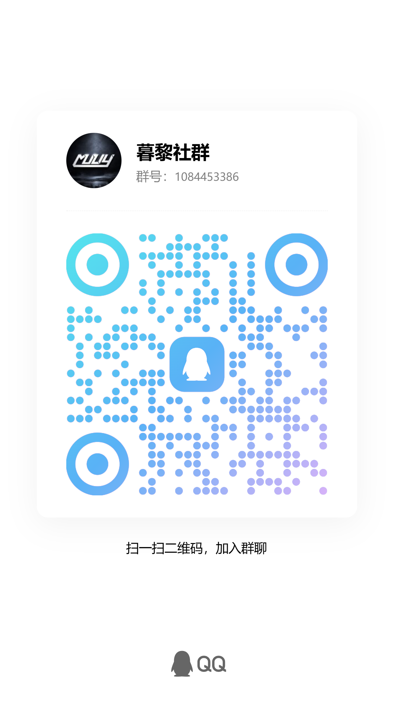

<p align="center">
  
</p>

<h1 align="center">🍄 暮黎资源聚合</h1>

<p align="center">
  <strong>一个 AstrBot 插件，搞定你的影视 / 游戏 / 软件 / 小说搜索与日报推送</strong>
</p>

<p align="center">
  <a href="https://github.com/MuliyStudio/astrbot_plugin_muliyresources/releases"></a>
  
  
  
  
</p>

---

> ⚠️ **免责声明**：本插件仅用于内部测试与学习交流，请勿用于商业用途，侵权请联系删除。
> 💬 交流群：**1084453386**

---

## ✨ 功能特性

| | 功能 | 说明 |
|---|------|------|
| 🎬 | **影视搜索（双源自动切换）** | 配置 `muliy_cookie` 走**教父.com 新站**（在线播放 + 网盘下载，自动选最低延迟节点）；未配置自动回退 **a123tv 旧站**（免登录）。剧集自动选集数、电影直接选线路 |
| 🎮 | **游戏搜索** | 搜索 xdgame.com，返回多网盘下载链接（百度/夸克/阿里/123/天翼…） |
| 💿 | **软件搜索** | 搜索 x6d.com 软件/应用/工具资源 |
| 📖 | **小说搜索与下载** | 基于 [so-novel](https://github.com/freeok/so-novel) 多源聚合，搜书名/作者 → 选源 → 选格式（txt/epub/html/pdf）→ 整本发送 |
| 📰 | **日报推送** | 软件 / 游戏 / 影视三套**定时日报**，自动渲染成图片以文件形式推送到群 |
| 🎵 | **网易云语音名片** | 发网易云链接/小程序卡片，自动解析成**语音**发出来（内置直连，零部署） |
| 🎞️ | **VIP 视频解析** | 爱奇艺 / 腾讯 / 优酷 / 芒果 VIP 链接自动解析成播放直链 |
| 🧠 | **LLM 自然语言** | 接入 LLM 后直接说「帮我找原神」「想看流浪地球」即可，无需记命令 |
| 🤚 | **表情包娱乐** | `摸摸 @某人` / `给你一脚 @某人` / `给我按摩 @某人` 生成 GIF |

---

## 📦 安装

### 方式一：AstrBot 插件市场（⭐ 推荐）

1. 打开 AstrBot WebUI → **插件管理**
2. 搜索「**暮黎资源聚合**」→ 点击安装
3. 安装完成后**重启 AstrBot**，插件自动安装依赖

### 方式二：手动安装

```bash
cd <astrbot>/data/plugins/
git clone https://github.com/muliystudio/astrbot_plugin_muliyresources.git
# 重启 AstrBot
```

### ✅ 首次使用检查清单

装好插件重启后，**大部分功能直接可用**，不用配任何东西：

| 功能 | 装好即用？ | 备注 |
|------|:---:|------|
| 🎬 影视搜索（a123tv 旧站） | ✅ | 想升级到教父.com 新站 → 配 `muliy_cookie` |
| 🎮 游戏搜索 | ✅ | 默认走 xdgame，配账密后可用 `/game_cookie_refresh` 自动登录 |
| 💿 软件搜索 | ✅ | |
| 📰 软件 / 游戏 / 影视日报 | ✅ | 无浏览器也能出图（Pillow 兜底）；想更精美 → 装 Chromium（可选） |
| 🎵 网易云语音名片 | ✅ | 免费歌直接解析；VIP 歌需填会员 Cookie |
| 🎞️ VIP 视频解析 | ✅ | |
| 🤚 表情包 | ✅ | |
| 📖 **小说搜索** | ⚠️ 需额外部署 | 需另跑一个 so-novel 服务，见下文 |

> **想省事的话**：什么都不用装、什么都不用配，装好插件就能搜影视/游戏/软件、能收日报、能发语音。

---

## 🚀 快速上手（小白使用手册）

### 第 1 步：先试试命令式用法（无需任何配置）

直接对机器人发下面任意一条：

```
/找影视 流浪地球        # 搜索影视
/找游戏 黑神话悟空      # 搜索游戏
/找软件 微信            # 搜索软件
/找小说 斗破苍穹        # 搜索小说（需 so-novel）
/software_report        # 手动触发软件日报
```

发「想看电影：流浪地球」「帮我找原神」这类自然语言也**会被自动识别**并路由到对应搜索。

### 第 2 步：接入 LLM，体验自然语言

在 AstrBot 里配好任意 LLM 提供商后，直接说：

```
用户：想看流浪地球
机器人：🎬 影视搜索结果（共 5 个，第 1/1 页）……
用户：1
机器人：已选择：流浪地球 …在线播放/网盘资源
用户：1
机器人：🎬 流浪地球 + 播放链接……
```

> LLM 只是「翻译官」，搜索/详情/下载全部由插件工具执行，不会编造结果。

### 第 3 步：按需开启高级功能

| 想用 | 需要配置 |
|------|---------|
| 教父.com 新站影视（网盘资源） | `movie` → `muliy_cookie`（浏览器登录 Cookie，含 `app_auth`、`PHPSESSID`） |
| 游戏自动登录刷新 Cookie | `game` → `xdgame_username` + `xdgame_password` |
| 小说搜索下载 | 部署 so-novel + `novel` → `sonovel_base_url` |
| 网易云 VIP 歌曲 | `music` → `wyy_cookie`（黑胶会员 `MUSIC_U`） |
| 日报推到群聊 | 各自分组填 `xxx_group_ids`（软件/游戏/影视独立） |

### 常用命令速查

| 命令 | 权限 | 说明 |
|------|------|------|
| `/找游戏 <名称>` | 所有人 | 搜索游戏 |
| `/找软件 <名称>` | 所有人 | 搜索软件 |
| `/找影视 <名称>` | 所有人 | 搜索影视（自动选源） |
| `/找小说 <名称>` | 所有人 | 搜索小说（需 so-novel） |
| `/game_cookie_refresh` | 管理员 | 自动登录 xdgame 刷新 Cookie |
| `/game_cookie` | 所有人 | 查看游戏 Cookie 状态 |
| `/movie_cookie` | 管理员 | 查看/检测/设置教父.com Cookie（`/movie_cookie set <cookie>`） |
| `/software_report` `/game_report` `/movie_report` | 可配置 | 手动触发日报 |
| `/wyy <链接或ID>` | 所有人 | 手动解析网易云歌曲为语音 |
| `/wyy_login` | 管理员 | 网易云扫码登录（自动写入会员 Cookie） |
| `/novel_status` | 所有人 | 检查 so-novel 是否可达 |
| `/movie_status` | 所有人 | 检查影视站可达性 |

> 开启 LLM 后，以上功能均可自然语言触发，无需记命令。

### 😜 表情包触发（无需 @，直接发）

| 表情 | 触发词 | 说明 |
|------|--------|------|
| 🤚 摸头杀 | `摸摸` / `摸头` / `pat` / `rua` + `@某人` | 无 @ 摸自己 |
| 🐴 舔狗 | `给你一脚` / `踹` / `kick` + `@某人` | 马踢舔狗 GIF |
| 💆 按摩 | `给我按摩` / `给我揉揉` + `@某人` | 柴犬按摩 GIF |

---

## ⚙️ 配置指南

在 AstrBot WebUI → 插件设置 →「暮黎资源聚合」中，按分组填写。**大部分留空即可用默认功能。**

### 🎮 游戏（game）

| 配置项 | 默认 | 说明 |
|--------|------|------|
| `xdgame_username` / `xdgame_password` | `""` | xdgame 账号密码（用于 `/game_cookie_refresh` 自动登录） |
| `cookie` | `""` | xdgame 登录 Cookie（自动登录后自动写入，一般不用手填） |
| `game_source` | `auto` | 游戏源：`auto`（有 xdgame 账密走 xdgame，否则 switch618）/ `xdgame` / `switch618` |
| `max_search_results` | `32` | 游戏搜索最大结果数 |
| `game_report_enabled` | `true` | 游戏日报开关 |
| `game_schedule_hour` / `minute` | `23:00` | 游戏日报定时（独立） |
| `game_group_ids` | `[]` | 游戏日报推送群号 |
| `game_report_max` | `24` | 游戏日报每期上限 |

### 🎬 影视（movie）

| 配置项 | 默认 | 说明 |
|--------|------|------|
| `muliy_cookie` | `""` | **教父.com 新站 Cookie**（`app_auth=...;PHPSESSID=...`，用 `;` 隔开）。⚠️ 勿填 `browser_verified`/`browser_pow`（插件自动求解 PoW）。留空回退 a123tv |
| `movie_source` | `""` | 留空自动；填 `a123tv` 强制旧站 |
| `muliy_release_url` | `""` | 教父系发布页（默认挂了.com，留空即可） |
| `muliy_cache_ttl` | `3600` | 新站登录态缓存秒数 |
| `movie_report_*` / `movie_group_ids` / `movie_sections` | — | 影视日报开关/定时/群/区块（mv电影·tv剧集·ac动漫） |

### 🎵 网易云（music）

| 配置项 | 默认 | 说明 |
|--------|------|------|
| `wyy_auto_parse` | `true` | 自动识别网易云链接/卡片并解析成语音 |
| `wyy_backend` | `direct` | `direct`（内置直连，**零部署推荐**）/ `custom`（自建实例） |
| `wyy_custom_url` | `""` | 仅 `custom` 后端需要：自建 NeteaseCloudMusicApi 地址 |
| `wyy_cookie` | `""` | 黑胶会员 Cookie（`MUSIC_U=...`），解析 VIP 歌曲用 |
| `wyy_music_type` | `standard` | 音质：standard/exhigh/lossless/hires/sky/jymaster |
| `wyy_clip_seconds` | `600` | 最大语音时长（秒），默认整曲 |
| `wyy_audio_format` | `wav` | mp3 / wav |
| `wyy_proxy` | `""` | 网易云请求代理（云服务器 IP 被风控时填住宅代理） |

### 📖 小说（novel）

| 配置项 | 默认 | 说明 |
|--------|------|------|
| `sonovel_base_url` | `http://127.0.0.1:7765` | so-novel 服务地址 |
| `sonovel_search_limit` | `20` | 每源结果上限 |
| `sonovel_format` | `["txt"]` | 默认下载格式（txt/epub/html/pdf） |
| `sonovel_timeout` | `30` | 搜索超时（秒） |
| `sonovel_download_timeout` | `600` | 整本下载超时（秒） |

### 🎞️ VIP 解析（vip_video）/ 🌐 浏览器（browser）

- `video_vip_parse`（默认 `true`）：VIP 视频自动解析开关
- `video_vip_timeout`：单个解析接口超时（毫秒）
- `browser_channel` / `browser_exe`：日报 / VIP 解析共用浏览器（留空自动；日报无浏览器时自动用 Pillow 兜底出图）

---

## 📖 功能详解

### 🎬 影视：双源自动切换

- **配置了 `muliy_cookie`** → 走**教父.com 新站**：自动从发布页探测最低延迟节点、自动求解「浏览器安全验证」PoW，资源含**在线播放（多节点）+ 网盘下载（多网盘）**。
- **未配置**（或 `movie_source=a123tv`）→ **a123tv 旧站**：免登录，仅在线播放切换线路。
- 指令 `/找影视` 与 LLM「想看XX」统一走同一套源路由，无需手动切换。
- `/movie_cookie` 命令可随时查看 / 检测 / 更新 Cookie。

### 🔐 游戏 Cookie 刷新

xdgame Cookie 约 30 天过期。配置账密后执行 `/game_cookie_refresh`：

1. 插件纯 HTTP 自动登录 xdgame，**自动求解新版「人机验证」(Cap PoW)**，无需人工输验证码
2. 登录成功后 Cookie 自动保存，无需再操作

### 🎮 日报推送

- 三套日报（软件 / 游戏 / 影视）各自独立定时、独立群配置。
- **渲染（三级降级，无需装任何东西）**：
  1. 本地 Chromium（若已安装）→ 最高清
  2. **AstrBot 内置 `html_render`**（官方 T2I 服务）→ 装好插件即用，无需浏览器
  3. Pillow 纯 Python 兜底 → 永远可用
- 以**文件形式**发送到群，绕开发图体积上限。

### 📖 小说：so-novel 部署（唯一需要额外服务的功能）

so-novel 是独立服务，跑起来后小说搜索/下载才能用：

```bash
# Docker 一键起（Web 模式，端口 7765）
docker run -d --name sonovel -p 7765:7765 \
  -e JAVA_TOOL_OPTIONS="-Dmode=web" \
  ghcr.io/freeok/sonovel:latest
```

然后在插件 `novel` 分组填：

- **so-novel 与 AstrBot 同宿主机（都是 Docker）**：`http://172.17.0.1:7765`
- **AstrBot 非 Docker / 同机**：`http://127.0.0.1:7765`
- **跨机器**：`http://<内网IP>:7765`

> 更多部署与排错细节见 [SO-NOVEL部署指南.md](./SO-NOVEL%E9%83%A8%E7%BD%B2%E6%8C%87%E5%8D%97.md)。

### 🎵 网易云

- **免费歌**：发链接/卡片即自动解析成语音，零配置。
- **VIP 歌**：填 `wyy_cookie`（黑胶会员 `MUSIC_U`）或 `/wyy_login` 扫码。
- **云服务器被风控**（扫码提示「设备环境异常」/ 解析 403）：直接手填已登录的 `MUSIC_U` 到 `wyy_cookie`（推荐），或填 `wyy_proxy` 住宅代理。

---

## 🔧 依赖说明

| 依赖 | 用途 | 必需？ |
|------|------|:---:|
| Pillow | 图片生成 / 日报兜底渲染 | ✅ 必需 |
| requests / bs4 / apscheduler / httpx / aiohttp | 搜索 / 解析 / 调度 | ✅ 必需（AstrBot 一般自带） |
| **Chromium**（`playwright install chromium`） | 日报高清 HTML 渲染 | ⚠️ 可选（**AstrBot 内置渲染 / Pillow 兜底，装好插件即出图**） |
| **so-novel** | 小说搜索下载 | ⚠️ 可选（仅小说功能需要） |
| ffmpeg | 网易云语音截取 | ⚠️ 可选（不装发完整音频） |

> 日报渲染默认走三级降级：**本地 Chromium（若已安装）→ AstrBot 内置 `html_render`（官方 T2I 服务）→ Pillow 纯 Python**，三级都不需要你手动装任何东西。
> 若想用本地 Chromium 获得最高清渲染（可选），国内可加速安装：

```bash
PLAYWRIGHT_DOWNLOAD_HOST=https://npmmirror.com/mirrors/playwright \
  python -m playwright install chromium
```

---

## ❓ 常见问题（FAQ）

**Q：提示「Cookie 已失效」？**
执行 `/game_cookie_refresh` 自动刷新（需已配 xdgame 账密）。

**Q：日报提示「图片渲染失败」？**
新版已内置 Pillow 兜底渲染，**不再需要 Chromium**。若仍失败，看 AstrBot 日志中的具体报错。

**Q：小说搜索提示「so-novel 不可达」？**
确认 so-novel 容器加了 `-e JAVA_TOOL_OPTIONS="-Dmode=web"`（默认镜像启动的是 TUI 菜单不监听端口），并填对 `sonovel_base_url`。

**Q：LLM 不调用搜索工具？**
确认 AstrBot 已配置 LLM 且开启了工具调用；关闭 LLM 也能用 `/找XX` 命令。

**Q：网易云扫码提示「设备环境异常」？**
云服务器 IP 被网易云风控，见上文「云服务器被风控」方案：直接手填 `MUSIC_U` 到 `wyy_cookie` 即可。

**Q：支持哪些平台？**
aiocqhttp(OneBot v11)、企业微信、个人微信、QQ官方、Telegram、飞书、Slack、Discord 等。非 OneBot 平台自动用「文本+图片 / Markdown 卡片」发送结果，不依赖合并转发。

---

## 📝 更新日志

见 [CHANGELOG.md](./CHANGELOG.md)

---

## 💬 交流群

<p align="center">
  
</p>

<p align="center">
  <strong>QQ 群：1084453386</strong> · 扫码或搜群号加入，欢迎反馈问题与交流
</p>

---

## 📄 许可证

MIT License © 2026 暮黎 Muliy
